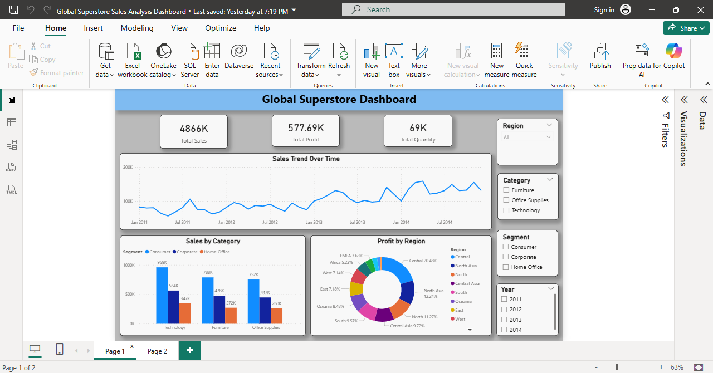
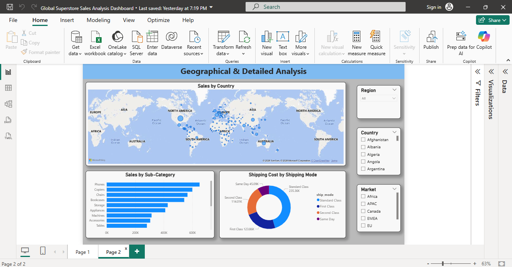

# Global Superstore Sales Analysis

This repository contains the Power BI dashboard file (.pbix) for the Global Superstore Sales Analysis project.

## Project Overview
- Sales Overview Dashboard (Page 1)
- Geographical & Detailed Analysis Dashboard (Page 2)
- Dataset: Global Superstore Orders

## Dataset Source
- The dataset is publicly available on [Kaggle](https://www.kaggle.com/datasets/laibaanwer/superstore-sales-dataset?resource=download)

## Tools Used
- Microsoft Power BI Desktop

## Dashboard Preview

### Page 1 – Sales Overview

### Page 2 – Geographical Analysis

## How to Open
Download the .pbix file and open in Power BI Desktop.
